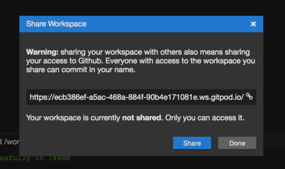

# Workspaces

A Gitpod workspace can be created from any GitHub project, branch, issue or pull-request.
Very soon Gitpod will support additional platforms and integrations for GitLab, Bitbucket, and Jira. 

# Context URLs

Gitpod derives the context of the workspace from the URL of the repository page from which it 
was started. Different issues, pull requests, or branches will result in separate workspaces,
allowing to easily perform individual tasks in their own isolated environments.

Each workspace consists of a full Linux container. From the IDE's terminal, the user can directly access 
all development tools of the Linux system and even install missing ones.

In the following we describe the supported contexts and what they do:

## GitHub Project Context

Creating a Gitpod workspace from the main project URL, will not imply a lot of contextual information. You will end up
in the master state with a local master branch. And the `Readme.md` will be opened in preview if it exists.

An example for this context would be `https://github.com/arunoda/learnnextjs-demo`.

## GitHub File Context

The file context is an extension to the simple project context, in that it will checkout the corresponding branch 
and open the editor you are looking at. 

An example for this context would be `https://github.com/arunoda/learnnextjs-demo/blob/getting-started/pages/index.js`.

When pointing to a folder, e.g. `https://github.com/arunoda/learnnextjs-demo/tree/create-dynamic-pages/pages` the containing `Readme.md``
will be opened when existing.

## GitHub Issue Context

When starting a workspace from a GitHub Issue, a local branch named `GH-{issue-nr}` will be created which is based on the remote's 
default branch. In most cases that would be `origin/master`.

In addition the Commit message is preconfigured with `fixes #{organization}/{repo}/{issue-nr}`. This will automatically close the GitHub issue, once
such a commit is merged into the default branch.

Once changes have been committed locally, the `Pull Request` view on the right can be used to push changes to a remote repository and create a pull request.

## GitHub Pull Request context

Starting workspaces from pull requests will of course clone the respective branch and opens the file changes of the respective PR in a viewon the left.
The first change is opened already in the diff editor. Also the `pull request`-view on the right is configured with the respective information.

This context is meant to be used for code reviews and/or to take action on feedback you got from a reviewer.

# Life of a Workspace

Creating fresh worksapces is as easy as clicking a button on a GitHub page. In most cases it is simpler to create fresh workspaces rather than going back to
older ones. See the [dashboard documentation](60_Dashboard.md) on how to see your workspace history and restart previous ones.

## Timeouts
Any running workspace will automatically stop after 30 minutes of inactivity. Activity is triggered by doing something in the IDE. 
Moving the mouse is enough. If the IDE is still open, a dialog will pop up that lets the user start
the workspace again.

## Stop and Archive
If you don't want to waste Gitpod hours unnecessarily you can stop your workspace explicitly. To do so click on the avator in the top right
and choose the `Stop Workspace` command (also available through the command palette).
The dialog will suggest you to also archive the workspace. Archived workspaces will be removed from workspace list in the dashboard and will not be 
considered when starting a fresh workspace for the same context URL again.

Workspaces can also be stopped, started, archived and unarchived from the [dashboard](60_Dashboard.md). 

## Changes are Saved
Gitpod always syncs the current state of the workspace's repository in the cloud, such that 
you can revisit it later. Files in other locations will not be saved. Gitpod does not delete 
any of these workspaces. See [dashboard](60_Dashboard.md) for details.

## Shared Workspaces
Workspaces can be shared from the [dashboard](60_Dashboard.md) or from within the IDE.
In the IDE, right-click on the user's avatar and choose **Share Workspace**. The URL you can share with your colleague
is shown in the dialog.

Anybody with this URL and a Gitpod account will be able to access the workspace as long as it is shared and running. 
By unsharing the workspace, the link becomes useless to anybody but the workspace owner. 
All users that are currently logged in to the same workspace will be shown as avatars 
in the top right corner of the IDE. So you always know how is looking at your workspace.

Guests share the same Theia backend, including the filesystem and the terminals that the 
host had opened when they entered the workspace. Opened editors, editor content, and 
other UI state are currently not shared. 

**Security note: Since the git command in the workspace is configured with your personal GitHub token, it is shared, too! **

So every action towards GitHub in a shared workspace happens on behalf 
of the workspace owner's GitHub account without further authorization. It is highly recommended to only 
share workspace URLs with trusted others and unshare workspaces when sharing is no 
longer necessary. A Gitpod workspace really is your personal machine.