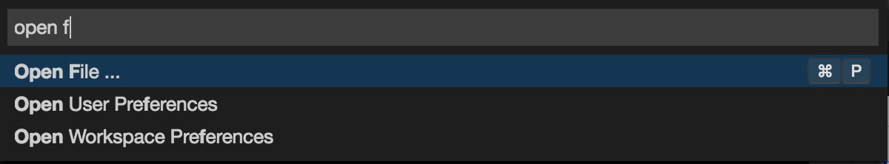
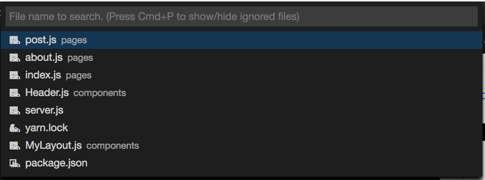
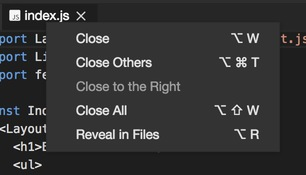
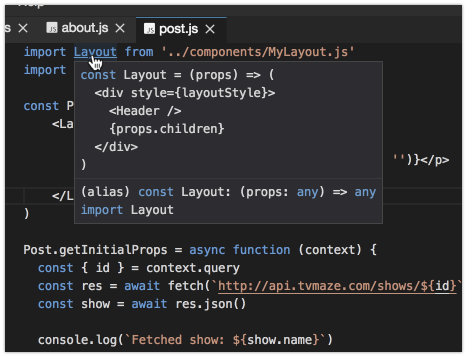
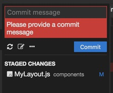
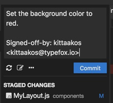
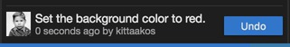

# Navigating the Code

Open the Command Palette with <kbd>F1</kbd> (or <kbd>Ctrl</kbd>+<kbd>Shift</kbd>+<kbd>P</kbd>) to access all the available
commands within Theia and type `Open File...`.  Before selecting the command, you
can check and memorize the keybinding: it is <kbd>Ctrl</kbd>+<kbd>P</kbd> (<kbd>⌘</kbd>+<kbd>P</kbd> on macOS). Next time
you do not have to access the Command Palette, but just use the keybinding.

Opening files from the Command Palette. All the workspace files can be accessed
with the <kbd>Ctrl</kbd>+<kbd>P</kbd> (<kbd>⌘</kbd>+<kbd>P</kbd> on macOS) keybinding. By default, it does not show
hidden and filtered resources. Pressing the <kbd>Ctrl</kbd>+<kbd>P</kbd> once more will show all
the hidden files too. Select your file and open it in the editor by pressing <kbd>Enter</kbd>.

Type `index` and select `index.js` to open it in the editor. Once the file is opened,
it will be automatically revealed in the `Files` navigator. You can also achieve
this by right-clicking on the editor's tab and select `Reveal in Files`. Open `about.js`
from the Command Palette and `post.js` from the `Files` navigator.

As you see, all the three modules import the `Layout` function from the `MyLayout`
module. Let's check out what the `Layout` function does. Right-click on `Layout`
in the editor, and select `Peek Definition` (<kbd>Alt</kbd>+<kbd>F12</kbd>). This brings up an inline editor.
You can glance into the implementation without bringing up a new editor. You can close
the inline editor any time by pressing <kbd>Esc</kbd>. Alternatively, you can peek into the
implementation by hovering over `Layout` and pressing the <kbd>Ctrl</kbd> key (<kbd>⌘</kbd> on macOS).

Let's open `Layout` in an editor. Hold the <kbd>Ctrl</kbd> (<kbd>⌘</kbd> on macOS) key down while clicking
on the function in the editor. This will open `MyLayout.js` in a new editor.

You can find and open the `Layout` from the Command Palette, too. Press <kbd>Ctrl</kbd>+<kbd>P</kbd> and type
`Open Workspace Symbol...` (<kbd>Ctrl</kbd>+<kbd>O</kbd>), press Enter and type `Layout`.

 
Let's change the styles of the web application a bit: we would like to have a `gold`
background color. Open the `Layout` symbol if you have not done that yet and change
the style by editing the `layoutStyle` object. Add the `background: 'gold'`.

To make this change permanent in the web application, we need to commit
this change to Git and push the modification to the remote. Let's activate the Git view
by selecting it from the left side-bar. The Git view can be accessed from the
`View` > `Git` menu item as well, or with the <kbd>Ctrl</kbd>+<kbd>Shift</kbd>+<kbd>G</kbd> (<kbd>⌘</kbd>+<kbd>Shift</kbd>+<kbd>G</kbd> on macOS).

### The Git View

The Git view consists of three major parts. On the top, the commit message with a few basic
Git commands. Below, the changed files are listed in two section: the staged and the unstaged
changes. In the bottom, we can have a quick insight into the latest commit.

Let's review the change we have made in the `MyLayout.js` file. Double click on the file to
open it in the diff editor. In the diff editor, the left-hand side shows the HEAD state and
the right-hand side shows the local, unstaged modification. Let's change the `gold` to another
color. This modification can be applied in the diff editor, but if you feel comfortable doing
this in the editor, just press <kbd>Ctrl</kbd>+<kbd>Alt</kbd>+<kbd>Q</kbd> (<kbd>⌘</kbd>+<kbd>Alt</kbd>+<kbd>Q</kbd> on macOS). This keybinding navigates you to the location
of the last modification. This can be achieved from the `Go` > `Last Edit Location` menu, or
from the Command Palette. Just search for `Go to Last Edit Location`. Change `'gold'` to
`'red'`.

We are happy with the red color, let's push this change to Git. Stage the change by clicking
the plus (`+`) arrow next to the file in the Git view and hit the `Commit` button.

We can see a validation error, we need to specify a commit message and then click on the
`Add Signed-off-by` button right under the commit message. This will extract the `user.name`
and the `user.email` from your Git configuration and will append it to the end of the commit
message. Press the `Commit` button once more.

Our change has been successfully committed; this can be verified at the bottom of the Git view.
It shows our most recent commit. Unfortunately, we have changed our mind and we prefer the `gold`
color over the `red`. Let's `Undo` the change.

`Undo` is a convenient functionality provided by Theia, so that you can easily modify your most
recent change. Under the hood, it resets the `HEAD` to the previous commit (`HEAD~`) but does not
touch the index file or the working tree at all. Let's undo the commit, set the color to `gold`
and adjust the commit message accordingly.

Finally, we are content with the new background color; push the change to the remote. Either
select `...` > `Push...` from the Git view or user the Command Palette: `Git: Push...`.

