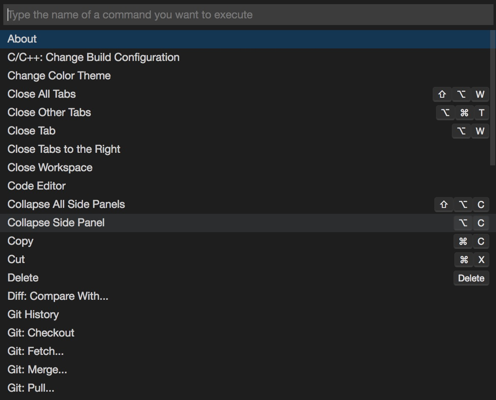
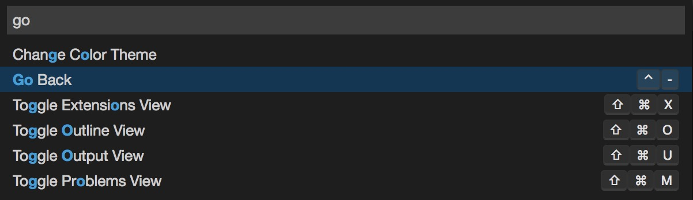
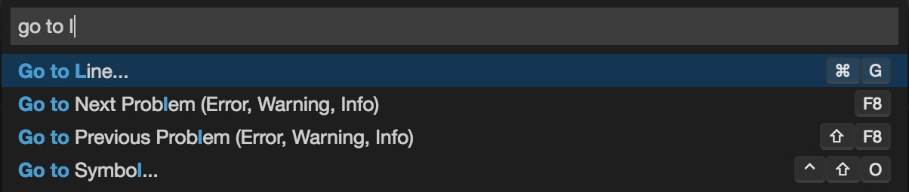

# Command Palette

### Accessing the Command Palette

Users can access common Theia commands and functionalities from the keyboard. An essential combination to know is the <kbd>Ctrl</kbd>+<kbd>Shift</kbd>+<kbd>P</kbd> (<kbd>⌘</kbd>+<kbd>Shift</kbd>+<kbd>P</kbd> on macOS) which opens the **Command Pallette**.

### The Command Palette is Contextual

The **Command Palette** contains all commands that are available from the application. Most of the accessible commands are context dependent. That means only those commands are visible that have an active handler, hence can be executed. For example, the `Go To Line...` command is only available when there is an active `Code Editor` opened in the application.

The **Command Palette** provides access to various commands. You can execute editor commands, open files and resources, search for symbols, and you can even perform Git operations, all using the same interactive window. Here are a few hints:

 - <kbd>Ctrl</kbd>+<kbd>P</kbd> (<kbd>⌘</kbd>+<kbd>P</kbd> on macOS) will let you open and navigate to any file.

### Further remarks

The following conventions are applied on the command labels:

 - Some of the commands are prefixed with the name of the contributing extension. For instance, `Git: Push...` or `Diff: Compare With...`.
 - If a command requires further user input, then the command label is suffixed with the `...`. For instance, `Tasks: Run...` or `Open File...`.