# Pull Requests

This section guides you through how to create pull requests (PR) from Gitpod with a small example.

Go to your GitHub repository.

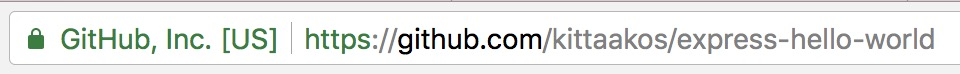

If you have the Gitpod extension installed in your browser just click on the Gitpod button.

If you do not have this extension. Copy the URL of your repository and change the  `https://gitpod.io/workspaces/` URL to `https://gitpod.io/github.com/kittaakos/express-hello-world`.

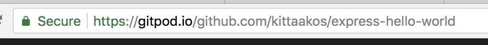

As you can see, we are currently on the `master` branch.

We want to follow the GitHub flow and apply our changes on a branch. So let's create a branch for the PR. You can either click on the branch name in the status bar, or use the `Git: Checkout...` command from Command Palette.

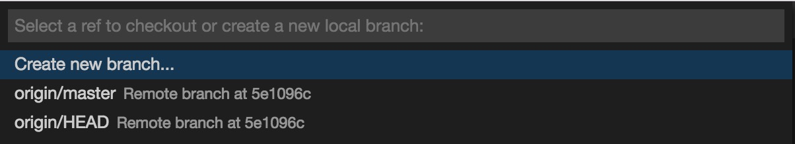

Select the `Create new branch...` command and specify the desired name of your branch.

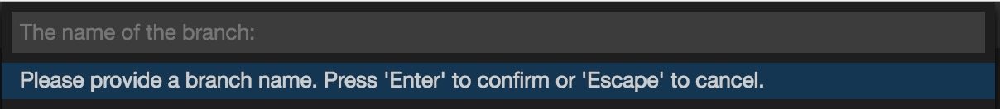
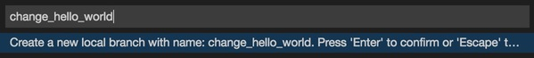

After creating the new branch, Gitpod automatically switches to the new branch. Note, this branch is a local branch, we need to publish it to the remote.

Let's confirm and push the branch to the remote.

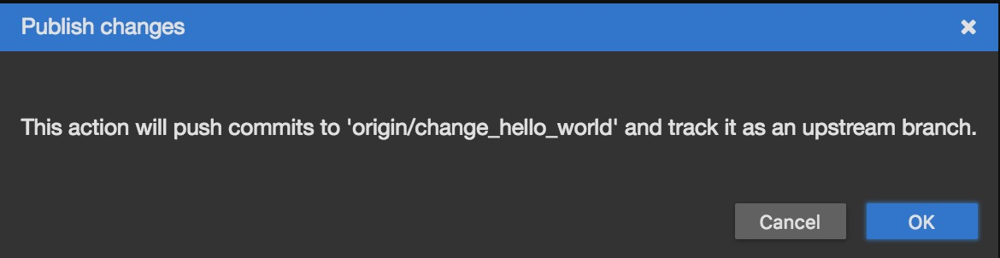

Before starting the actual work, let's take a brief look onto the branch status. We are on the desired branch and we have zero outgoing and zero incoming changes. Keep in mind, the status bar always gives you an instant insight of your current branch's state.

Let's make the change. Open the `main.js` module. You can either open the file from the `Files` navigator, or use the `Open File...` command from the Command Palette: <kbd>Ctrl</kbd>+<kbd>P</kbd> (<kbd>Ctrl</kbd>+<kbd>P</kbd> on macOS).

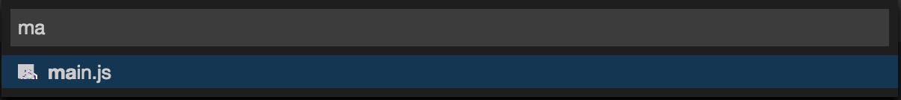

Let's change the `Hello World` to `Gitpod`. You do not even have to save the editor, it is done automatically by default.

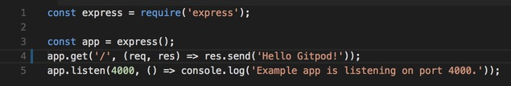

Let's review and commit the changes, so that we can create the PR. Open the `Git` view either deom `View` > `Git`, selecting it from the side-bar, or pressing the <kbd>Ctrl</kbd>+<kbd>Shift</kbd>+<kbd>G</kbd> (<kbd>Ctrl</kbd>+<kbd>Shift</kbd>+<kbd>G</kbd> on macOS) keybinding. Double-click on the `main.js` from the `Git` view.

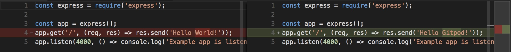

Excellent, this is what we wanted to change. Add your file to the Git index by staging it from the `Git` view; click on the `+` sign after your file name. Specify a commit message, and click on the `Add Signed-off-by` action right below the commit message input field and hit the `Commit` button.

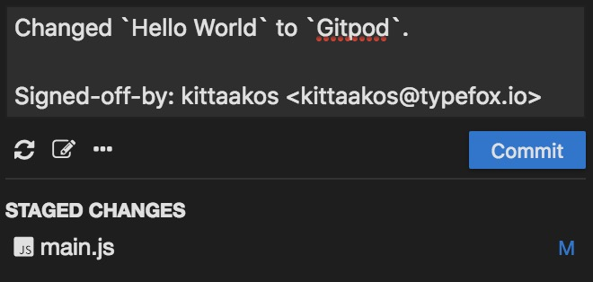

You can see, the last commit has been updated in the bottom of the `Git` view. It shows our changes. You can also see in the status bar, you have one outgoing change. Lets's push the commit to the remote. Click on the `...` action right below the commit message input and select `Push...`. As always, alternatively, you can use the `Git: Push...` command from the Command Palette.

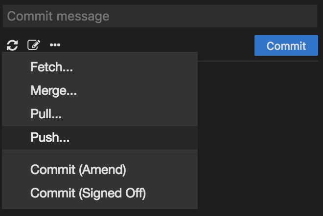

Select the the the default remote: `origin`.

We have successfully pushed to the remote, the status bar shows zero outgoing changes.

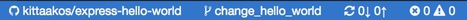

Create the PR. Open the `Pull Request` view from `View` > `Pull Request` or use the keybinging: <kbd>Ctrl</kbd>+<kbd>Shift</kbd>+<kbd>H</kbd>. The title and the description of your PR is already populated based on your commit in the `Pull Request` view. By default the base branch of your PR is set to `master`. You can alter it by clicking `master` in the view.

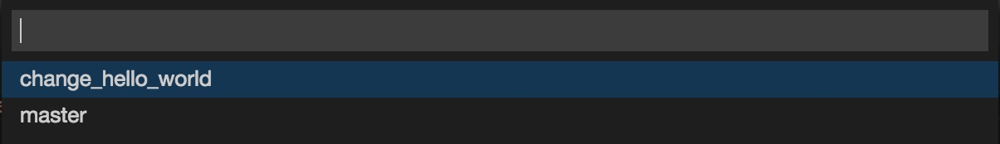

But let's leave as is now. We want to create the PR agains the `master` branch. Hit the `Create Pull Request` button and review your first PR created from Gitpod.

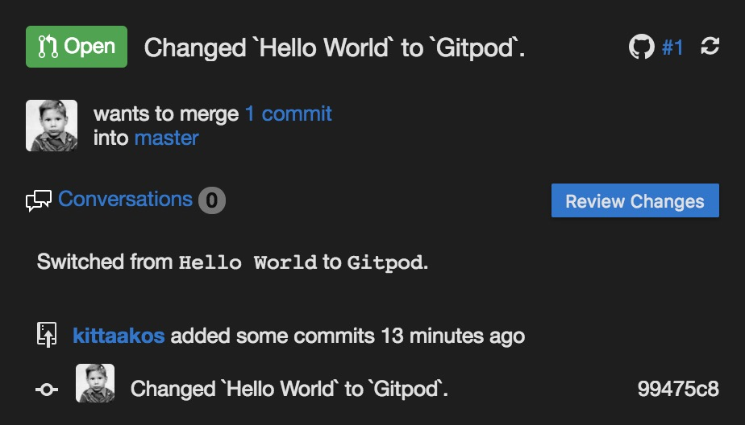

It was easy, right? Courous? Do you want to check your PR on GitHub. Just click on the number of your PR in the top of the `Pull Request` view, it will navigate you to GitHub.

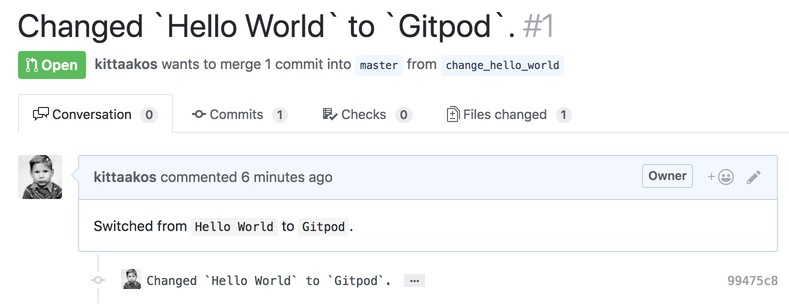

