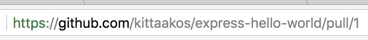
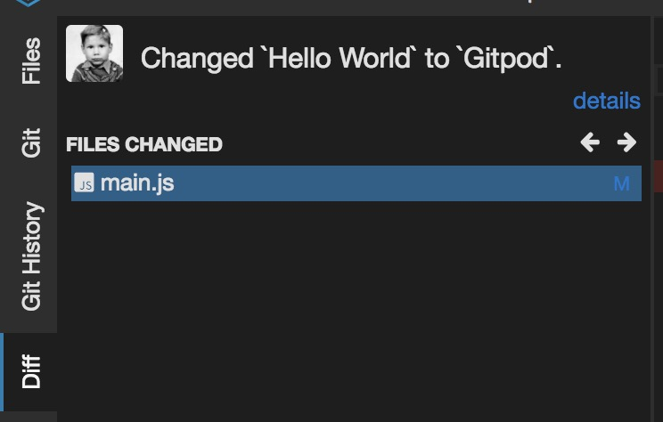
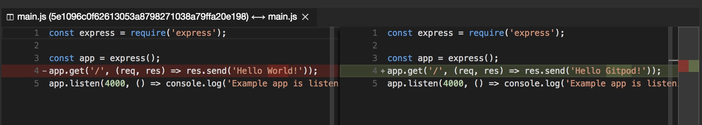
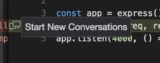
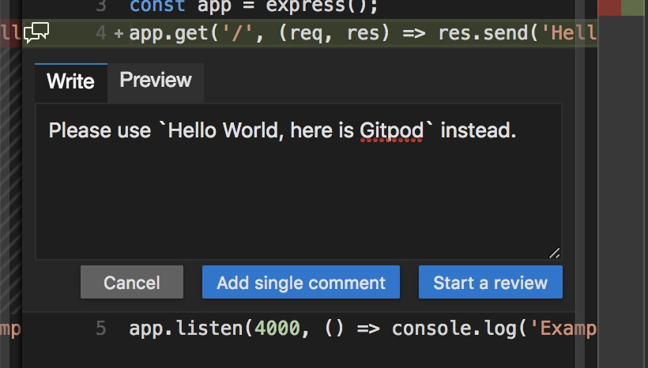
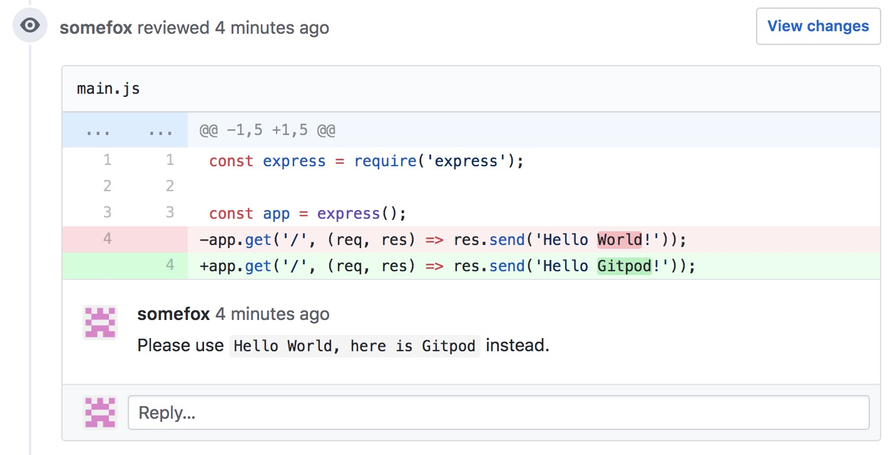
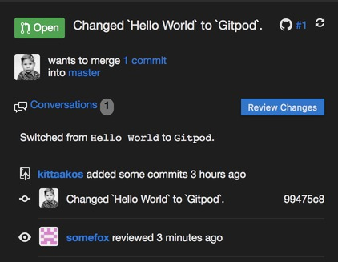
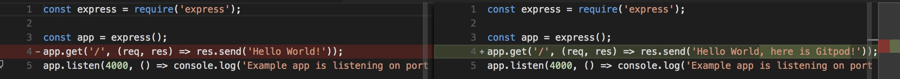
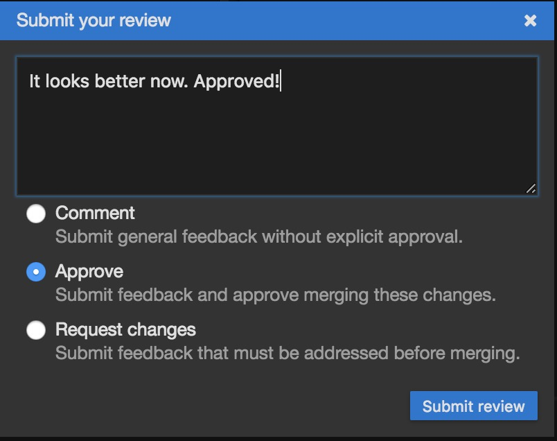
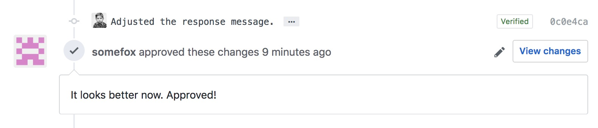

# Code Reviews

This section gives you a brief introduction to the code review flow with Gitpod. This assumes if you are already [familiar with the pull request (PR) creation process](4_3_2_Pull_Requests.md) and you already have a PR ready for the review.

First off, go to your PR on GitHub.

If you are using the Gitpod extension in your browser, click on the Gitpod button it will start your Gitpod workspace with all the changes.

Otherwise, you need to suffix the `https://gitpod.io/workspaces/` URL with the URL of your PR: `https://gitpod.io/github.com/kittaakos/express-hello-world/pull/1`.

Once your workspace is up, Gitpod immediately shows you the `Diff` view with all the changes made on the branch.

It also opens up the file with the relevant change.

Let assume, we are not happy with the current change, and we would like to suggest a modification. You can quickly add a comment from the diff editor's gutter. Just click on the `Start New Conversations` button. Note, this functionality works only for those files that were changed in the PR.

Start a new conversation and add some remark as a single comment.

Gitpod pushes your new comment to GitHub so everything is in sync.

Open the `Pull Request` view and click on the `Review Changes` button.

Request some changes for the PR.

Here, we assume, the other user has made all the desired adjustments and pushed the commit to the remote already. When the reviewer opens the changed `main.js` file in the diff editor, it already shows the most recent state of the file.

Approve the change and the entire PR.

You can verify the PR approval on GitHub; everything is in sync with Gitpod.

There are only two things you have to take care of: push the `Merge` button on GitHub and delete your branch.

