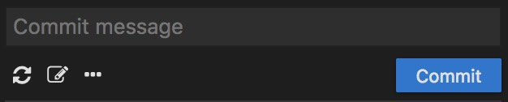
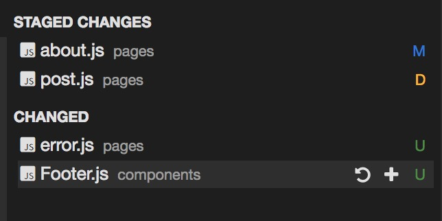
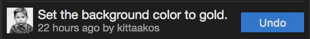
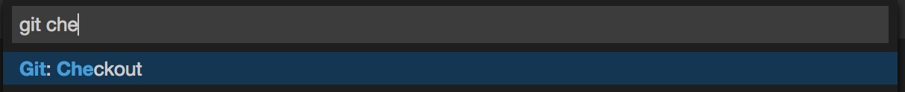
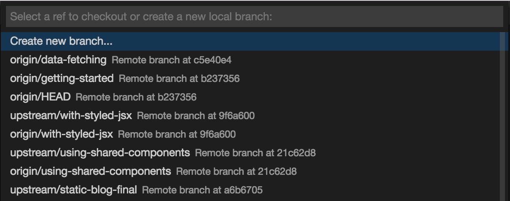
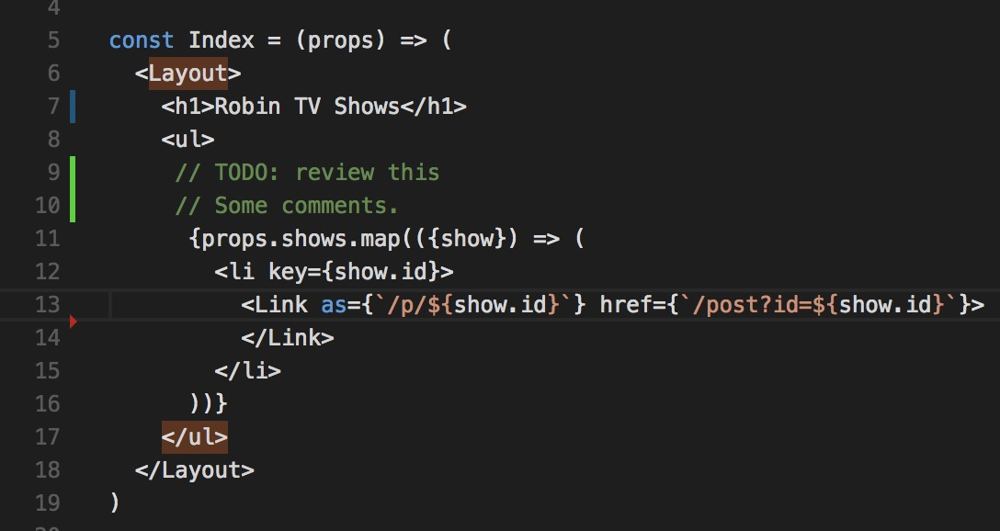
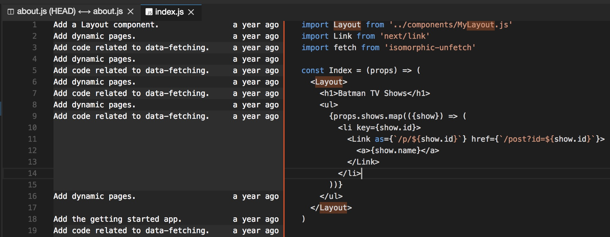
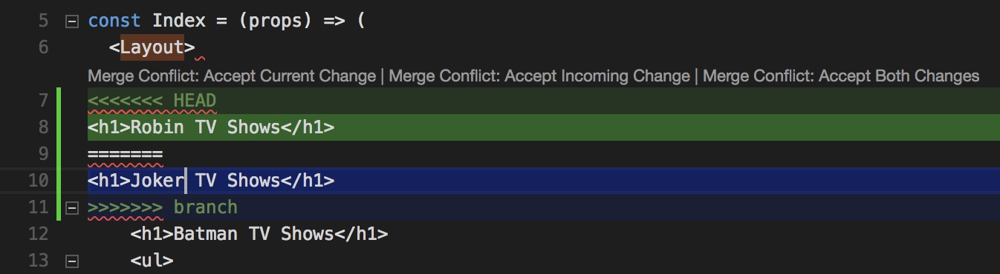
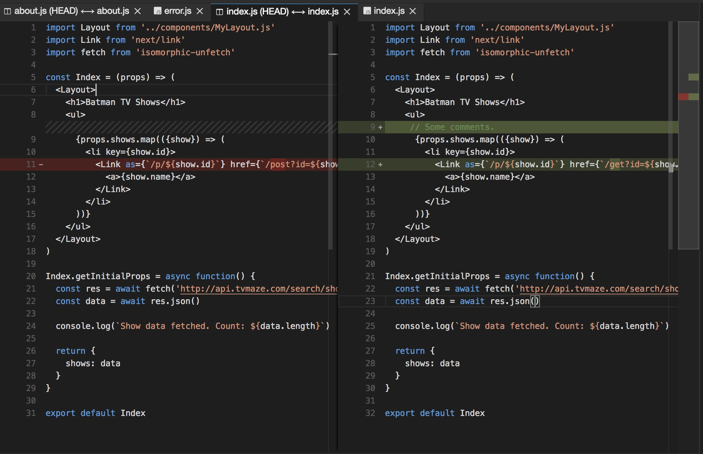
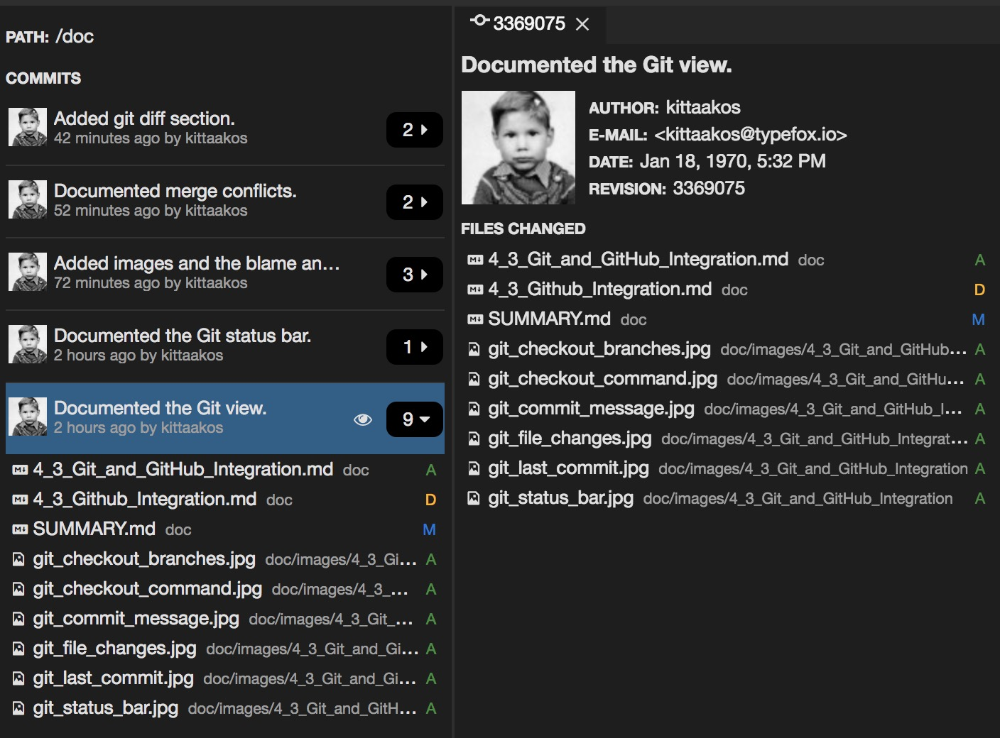

# Git & GitHub Integration

Theia ships with a Git extension.

## Git View

Theia ships with a Git extension. You can activate the `Git` view from the `View` > `Git` menu or with the <kbd>Ctrl</kbd>+<kbd>Shift</kbd>+<kbd>G</kbd> (<kbd>Ctrl</kbd>+<kbd>Shift</kbd>+<kbd>G</kbd> on macOS) keybinding.

The `Git` view consists of three major parts. The top section is for authoring the commit messages. It also provides access to a couple of basic Git commands.

Right below the commit section, the changed files with their names are listed in two groups: these a the `STAGED CHANGES` and `CHANGES`. The latter one groups all unstaged, changed resources.

At the bottom of the `Git` view, a small section gives a quick insight into the most recent commit.

In the list of staged and unstaged changes, the file names are followed by the path to their container folder and an indicator describing the type of the change. These are the followings:
 - `A`: new staged,
 - `U`: new unstaged,
 - `R`: renamed,
 - `C`: copied,
 - `M`: modified,
 - `D`: deleted, and
 - `C`: conflicted.

When a stage file is unstaged, its state can be reverted to the state of the working tree by clicking on the `Discard Changes` action right after the file location. However, if the resource is not under version control, it will be deleted from the workspace. Double-clicking on a modified resource will open it in a diff editor. The read-only editor on the left-hand side shows the state from the index. The right-hand side of the editor is the state of the working tree, and it still lets you modify the file. New and deleted files do not open in a diff editor. The files can be staged, added to the index, by clicking on the `Stage Changes` action (`+` sign), the counterpart operation is the `Unstage Changes` action (`-` sign).

After staging the desired files and specifying the commit message. The changes can be committed to the repository. After the successful commit, the `Last Commit` section will be automatically updated.

## Git Status Bar

In the bottom left corner of Theia, you can find indicators describing the status of your repository. It shows the current branch, dirty indicators and the number of ahead and behind changes of the current branch.

The dirty indicators are the followings:
 - `*` You have changes in your branch.
 - `+` You have staged changes in your branch.
 - `!` You have conflicting changes in your branch.

By clicking on the branch name, you can perform a `git checkout`. This operation is equivalent to the `Git: Checkout...` command from the Command Palette.

There is a `Synchronize Changes` action as well in the status bar, next to the branch indicator if the currently checked out branch has an upstream branch configured. `Synchronize Changes` will pull remote changes down to your local repository and then push local commits to the upstream branch.

## Branches and Tags

You can create and checkout branches directly within Theia through the `Git: Checkout...` command in the Command Palette. For creating a new branch, select the first item, `Create new branch...` from the list and specify the desired name of your branch. Theia creates the new branch for you and switches to it.

## Gutter Indicators

If you open a file in an editor that is under version control by Git, and start applying changes, Theia will add useful annotations to the gutter and to the overview ruler of the editor.

 - A red triangle indicates where lines have been deleted.
 - A green bar shows the newly added lines.
 - A blue bar indicates modified lines.

## Blame Annotations

You can show the blame annotation by either selecting the `Show Blame Annotations` from the editor's context menu or by picking `Git: Show Blame Annotations` from the Command Palette. This will show the blame annotations on the left hand-side of the editor. Press <kbd>Esc</kbd> if you want to hide the blame annotations.

## Merge conflicts

Theia recognizes merge conflicts. Theia highlights the differences and provides inline action to accept either the local or the incoming change. Alternatively, both modifications can be accepted at the same time. Once you have resolved the conflicts, stage your changes and commit it.

## Viewing Diffs

The Git extension supports viewing of diff withing Theia. Selecting any of the modified files will open a diff editor. As discussed earlier, the left-hand side is a read-only editor representing the index state, and the right-hand side editor is the working tree.

## Git History

Theia provides various ways to review the Git history.

 - The history of an individual file can be checked, or
 - The history of multiple files within a folder can be reviewed at once.

You can activate the `Git History` view from the `View` > `Git History` menu or toggle the view with the <kbd>Alt</kbd>+<kbd>H</kbd> command but the most convenient and recommended way is to right-click on the file in the `Files` navigator and select the `Git History` context menu item. The content of the `Git History` view does not update when changing the active editor or when altering the selection in the `Files` view. To get the history of an individual resource you have to either use the `Git History` command from the Command Palette or from the `Files` navigator's context menu.

The top of the `Git History` view shows the path of the resource or resources. Right below the path, you can see the list of commits with some details; such as the committer, the subject of the commit message and the relative time of the commit. You can open up the commit in a read-only editor to review all the details about the commit.

