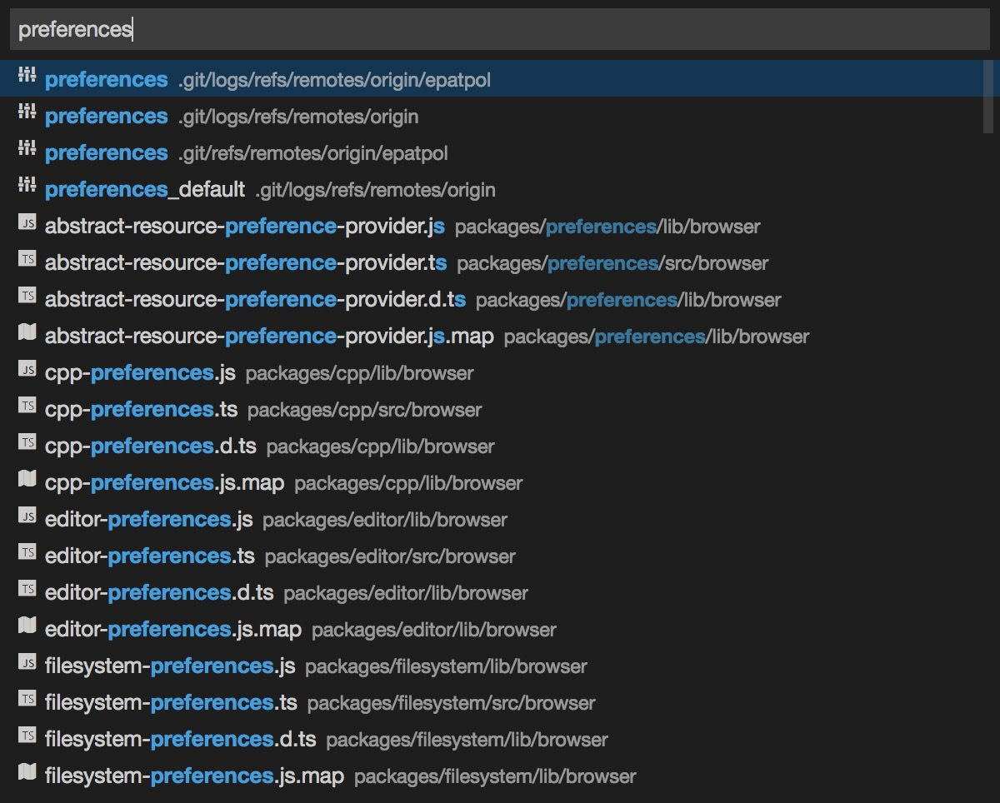
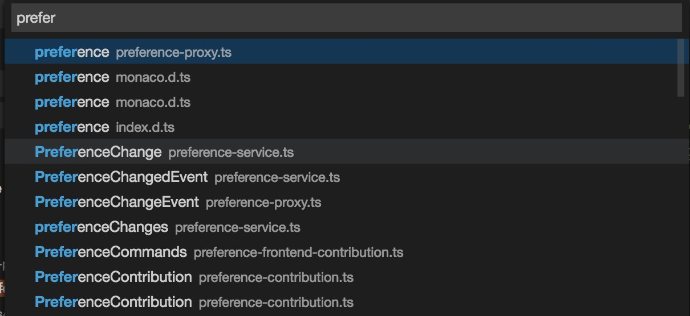
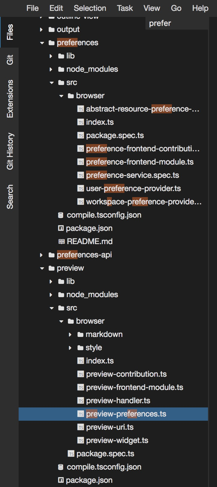
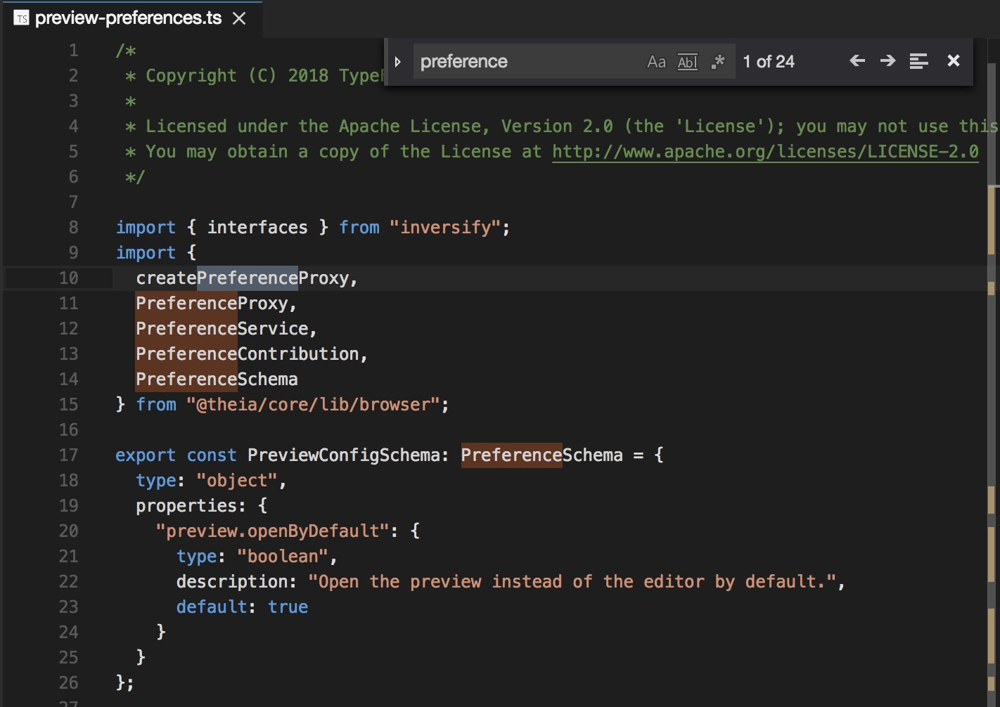
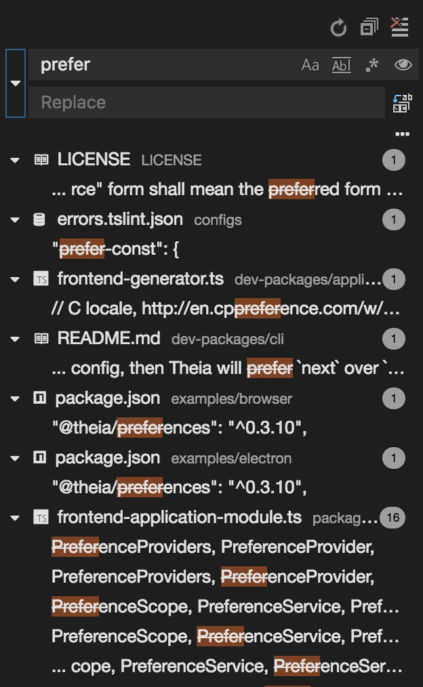
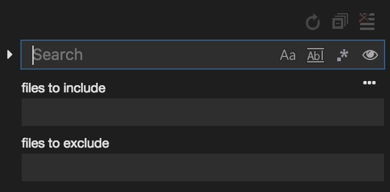
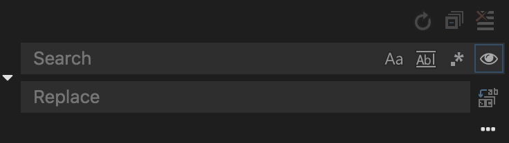
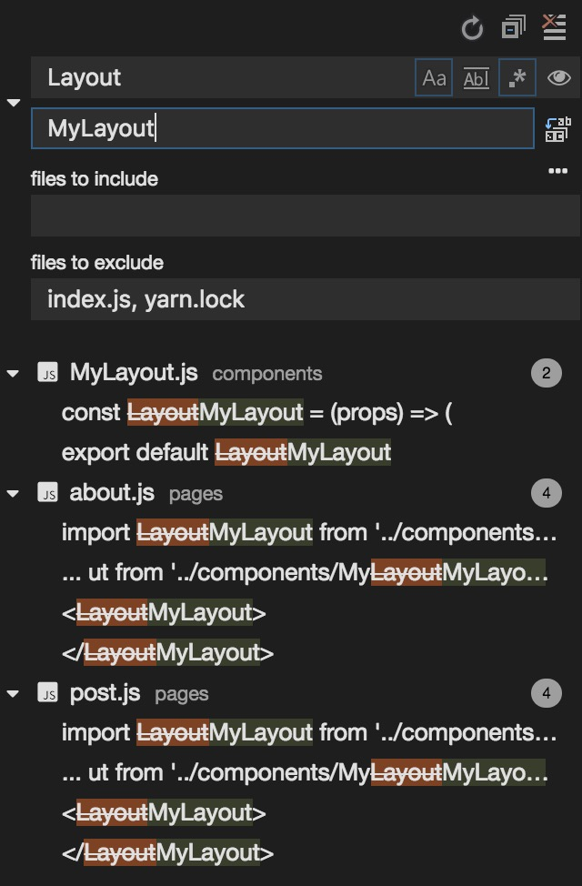

# Search

There are several ways to perform a search and to find things in the workspace.

## Open File...

Use <kbd>Ctrl</kbd>+<kbd>P</kbd> (<kbd>⌘</kbd>+<kbd>P</kbd> on macOS) to search among all files in the workspace.
By default hidden and filtered files do not show up among the results.

If you want to search within all files in the workspace, press <kbd>Ctrl</kbd>+<kbd>P</kbd> once more and perform your search.

Use this search if you would like to quickly open files based on their name.

## Open Workspace Symbol...

Press <kbd>Ctrl</kbd>+<kbd>O</kbd> (<kbd>⌘</kbd>+<kbd>O</kbd> on macOS) to find all symbols in the workspace.

## Navigator Search

When the `Files` navigator is the active widget, start typing to highlight all those files that name match your pattern.
This search ignores all collapsed files in the navigator. When the navigator search is active, and there are highlighted files,
you can use the cursor arrows to jump the matching resources in the navigator. You can finish your search anytime by hitting
<kbd>Esc</kbd>, deleting your pattern with the <kbd>Backspace</kbd>.

Use this to quickly locate a file in the `Files` navigator.

## Find and Replace in Editor

Press <kbd>Ctrl</kbd>+<kbd>F</kbd> (<kbd>⌘</kbd>+<kbd>F</kbd> on macOS) in the editor to open the `Find`/`Replace` search widget.
It is recommended to use this search functionality if you want to find something in a given file. As always, alternatively, you can
use the Command Palette (look for `Find`) or the `Edit` > `Find` menu item to open the search widget.

This functionality helps you finding all occurrences in a single file. Your query can match the whole word, can be case sensitive, or
even a regular expression. It also provides a convenient way to replace all you search occurrences.

## Search in Workspace

Unlike the Find and Replace in Editor functionality that searches within one single file, this performs a search in all files from the workspace.
If you have not yet activated the `Search` view, open it from the `View` > `Search` menu or with the <kbd>Ctrl</kbd>+<kbd>Shift</kbd>+<kbd>F</kbd> (<kbd>⌘</kbd>+<kbd>Shift</kbd>+<kbd>F</kbd> on macOS)
keybinding. In the `Search` view you can start typing and the matching results will be shown automatically without pressing <kbd>Enter</kbd>.
The search can be restricted to case matching, whole word matching or when desired the query can be given as a regular expression.
Search results are grouped into files containing the matching search term, with an indication of the hit count in each resource and its workspace relative location.
Expand a file to see a preview of all of the hits within that file. Then single-click on one of the hits to view it in the editor.

### Advanced Search Options

In the input box below the search box, you can enter patterns to include or exclude from the search. If you enter `theName`, that will match every folder and file named `theName` in the workspace.
If you enter `./theName`, that will match the folder `theName/` at the top level of your workspace. Use `!` to exclude those patterns from the search. `!theName` will skip searching any folder or file named `theName`.
You can also use glob syntax:

 - `*` to match one or more characters in a path segment.
 - `?` to match on one character in a path segment.
 - `**` to match any number of path segments, including none.
 - `{}` to group conditions (e.g., `{**/*.html,**/*.txt}` matches all HTML and text files).
 - `[]` to declare a range of characters to match (e.g., `theName.[0-9]` to match on `theName.0`, `theName.1`, …)

Theia excludes some folders by default (for instance, `node_modules` and others that are ignored by Git) to reduce the number of search results. If you would like to search for all files in the workspace, click on
the `Include Ignored Files` in the search field.

### Search and replace

You can also `Search and Replace` across files. Expand the `Search` widget to display the `Replace` text box.

When you type text into the `Replace` text box, you will see a diff display of the pending changes. You can replace across all files from the Replace text box, replace all in one file or replace a single change.
Double-clicking on any of the `Search and Replace` occurences, opens the file in a diff editor so that you can review the modification in the editor before eventually applying them.

