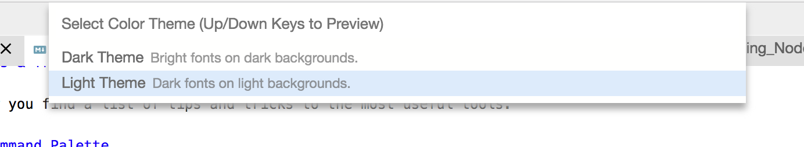
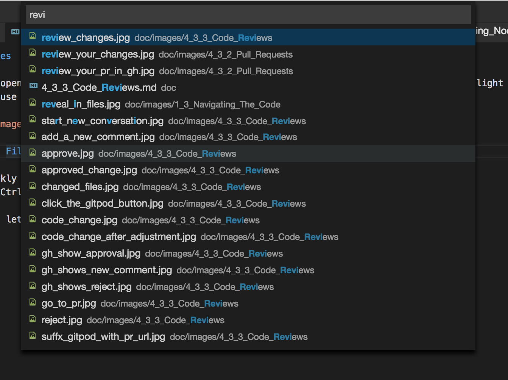

# Tips & Tricks

Below you find a list of tips and tricks to the most useful tools.

## Command Palette

The *command palette* is the center for a keyboard-centric interaction as well as for looking up available commands and key bindings. It is available through the following two key bindings:
 - <kbd>F1</kbd> 
 - <kbd>Ctrl+Shift+P</kbd> (<kbd>⌘+Shift+P</kbd> on macOS)

### The Command Palette is Contextual

The command palette lists only those commands that are available in the current context.
For example, the `Go To Line...` command shows in the palette only when a code editor is opened and has focus.

## Color Themes

Gitpod opens in its *dark theme*. If you prefer a lighter experience, you can switch to the *light theme*.
Simply use the command palette and select `Change Color Theme`.

## Open File

To quickly open any file using the keyboard, press:
- <kbd>Ctrl+P</kbd> (<kbd>⌘+P</kbd> on macOS).

It will let you search, find, and open any file by name.

## Search in Workspace

To search for or replace string occurences in all files of your workspace press:
- <kbd>Ctrl+Shift+F</kbd> (<kbd>⌘+Shift+P</kbd> on macOS)

It opens the search view, which is described in more detail [here](56_Search.md).

## Symbols and References

Most languages allow to name things and refer to them in other places, for example variables, 
functions, classes, modules etc. Gitpod supports this notion of such _symbols_ and _references_
to them and allows to navigate in both directions: 

- `Open Symbol` (<kbd>Ctrl+Shift+O</kbd>) finds a symbol by its name.
- `Find All References` (<kbd>Shift+F12</kbd>) lists all references to the symbol 
at the current position in an inline editor.
- `Go to Definition` (<kbd>Ctrl+F12</kbd> or <kbd>Ctrl/⌘</kbd>+click) brings you to
the definition of a symbol. `Peek Definition` (<kbd>Alt+F12</kbd>) does the same in an inline editor.
- `Rename Symbol` (<kbd>F2</kbd>) renames the symbol and changes all references to it accordingly.
