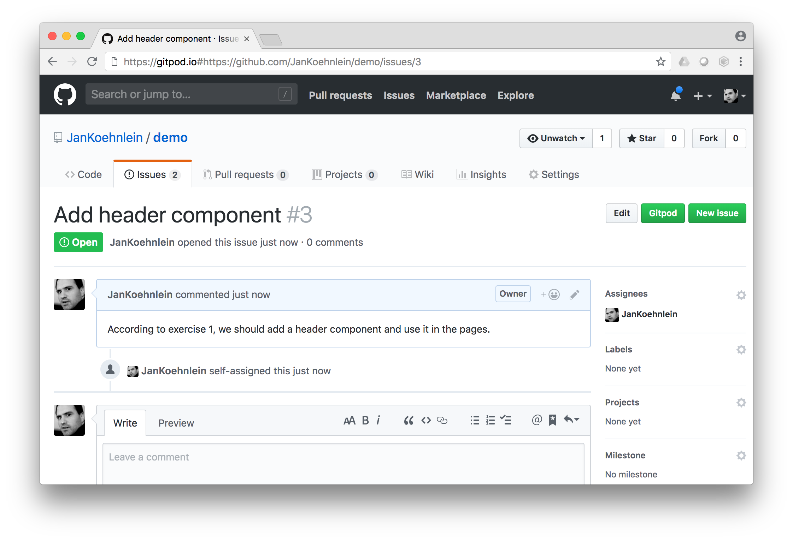
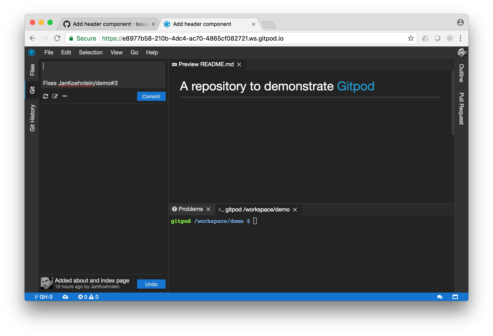
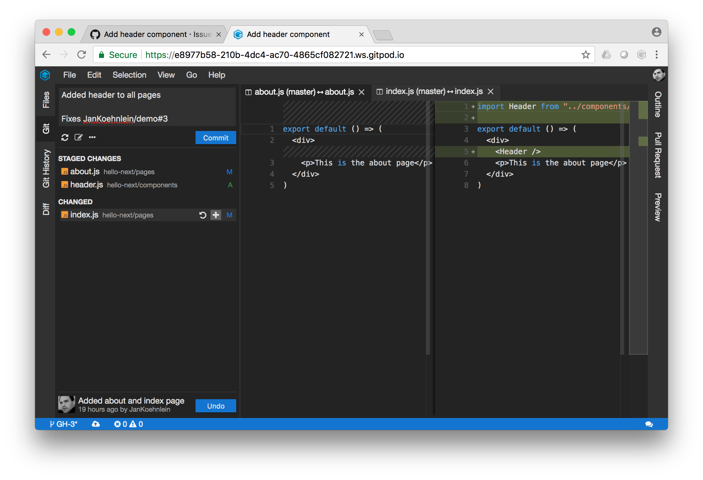
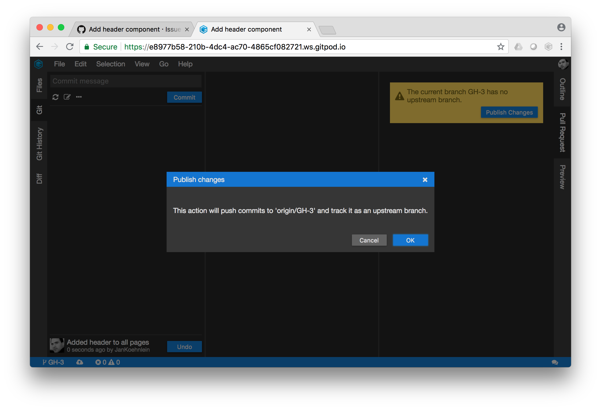
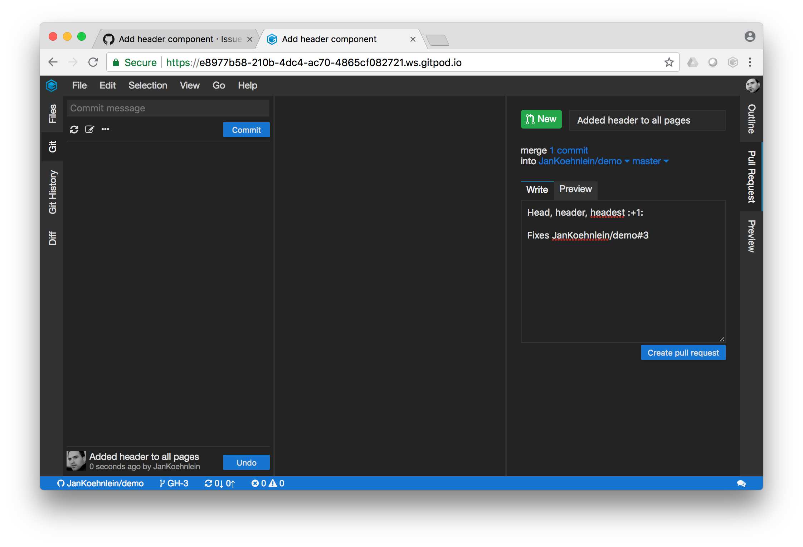
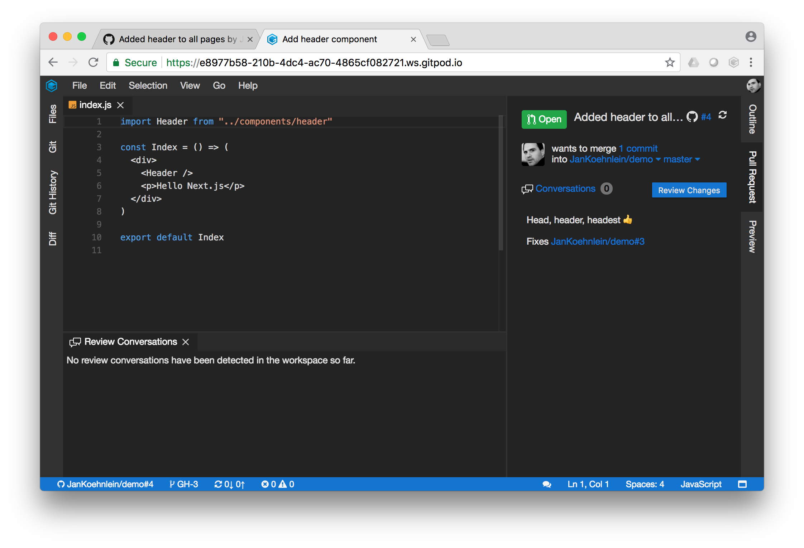
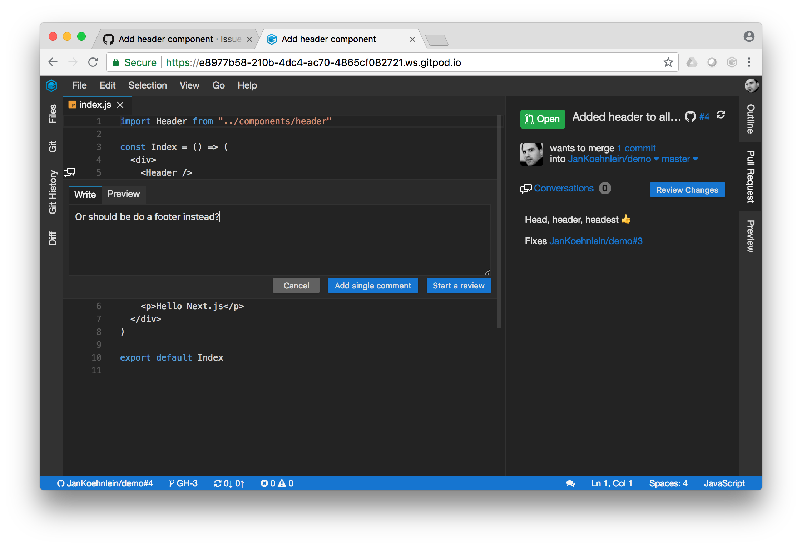
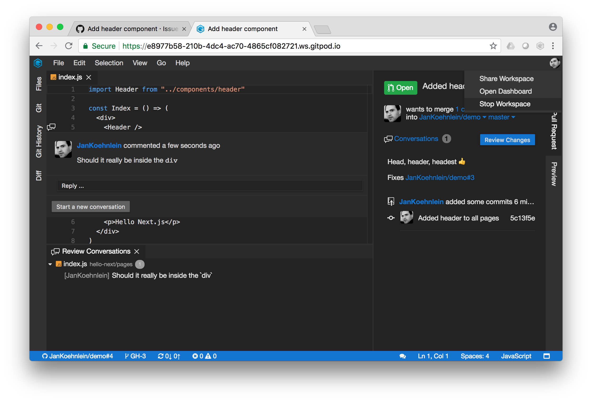

# Pull Requests

This section guides you through the process of creating a GitHub pull requests (PR) in Gitpod. 
In the GitHub flow, each programming task starts with a GitHub issue. In this issue, you describe
the task, what needs to be done, etc. It also logs all discussions related commits.

To start a Gitpod workspace for this issue, either prefix the issue's URL in the address bar with
`https://gitpod.io#` or click on the `Gitpod` button that comes with the 
[Gitpod browser extension](20_Browser_Extension.md). Gitpod will start your cloud workspace in a 
new browser tab now.

In the status bar in lower left corner, you can see that Gitpod created a local branch `GH-3` for 
your issue. Furthermore, if you open the `Git` view, the commit message has already prepared with 
a _Fixes..._ message that causes GitHub to automatically close the issue once this commit is merged.

Now lets apply a few changes. In this example, we add one file and change two existing ones. If you
want to browse through all changes so far, go to the `Files` navigator view, choose 
`Diff: Compare with...` and select master in the quick open menu. The `Diff` view allows you to go 
through all changes easily using the arrow keys.

Once you're done reviewing your changes, it's time to commit them. Go to the `Git` view and stage
all changed files by clicking on the `+` icon that pops up when you hover over the entries. Once 
everything is staged, add a meaningful commit message and push the `Commit` button.

The next step in the GitHub flow is to propose our changes as a pull request (PR). You can do that 
right now from within Gitpod. In the `Pull Request` view you'll see a message that our current branch 
has no remote tracking branch. By clicking on the `Publish Changes` button, this remote branch is 
created on GitHub and pushed to. 

The `Pull Request` view now allows you to change title and description in Markdown (the `Preview`
tab shows the rendered version) of the PR you to set the target branch to merge into. If your 
satisfied with all these values, click the `Create Pull Request` button. The pull request is now 
pushed to GitHub.

As soon as the PR is uploaded to GitHub, the `Pull Request` view will reflect that and provide you 
with review facilities. You can view it on or synchronize it with GitHub, change the target branch,
view the conversation or even start a review right now. 

Let's leave some additional comment on the code for the reviewers. Open one of the modified files 
and hover over the gutter to the left of the line numbers wher you want to add the comment, and click 
on the comment icon. Enter your comment (once again in Markdown with `Preview` facilities) and 
click `Add single comment`.

Your comment should now appear in the `Conversation` view, and once it is synced with GitHub, in the 
`Pull Request` view as well. 

It looks like we're ready here, so let's stop the workspace and let a colleague do the review. Click 
on the avatar in the upper right corner and choose `Stop Workspace`. In the following dialog, choose 
`Do it`.
